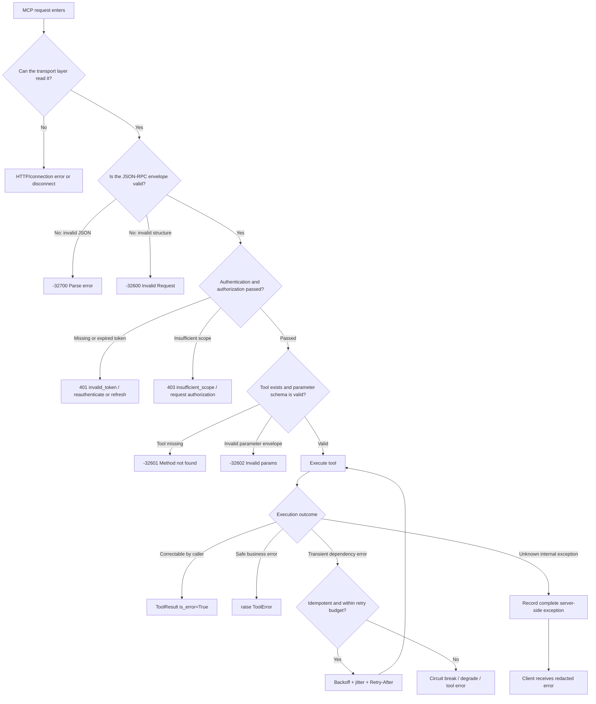
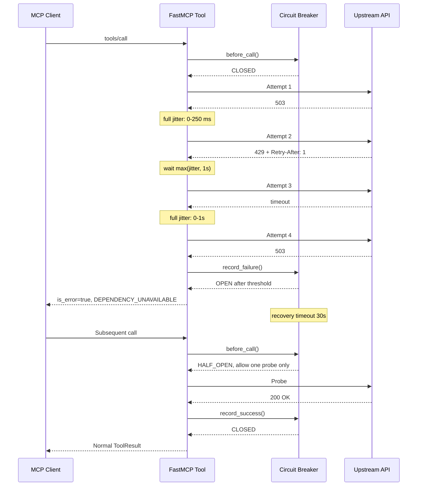
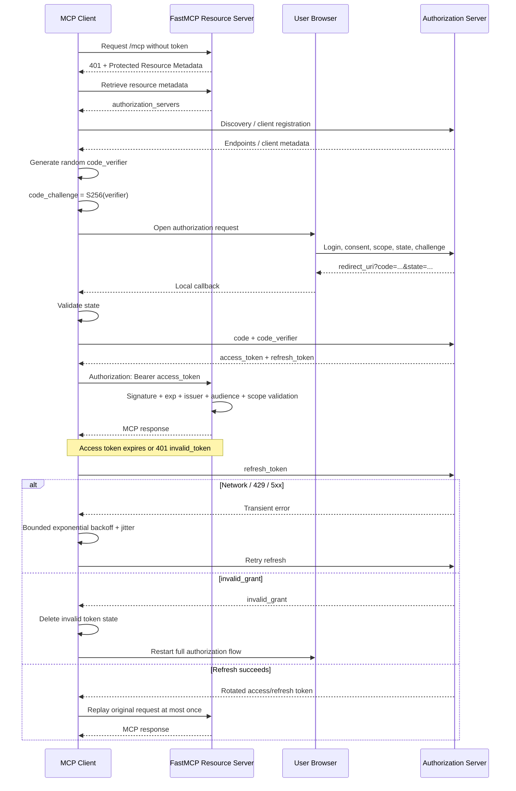

# Building an MCP Server Error-Handling Framework with FastMCP 3.4.5

## Executive Summary and Version Scope

FastMCP 3.4.5 was released on **July 27, 2026** as a maintenance release in the FastMCP 3.x series. The changes most directly related to error handling focus on OAuth and JWT compatibility: `JWTVerifier` now skips unsupported key types in a JWKS instead of allowing one unrecognized Ed25519 or other unsupported key to cause all token validation to fail. It also fixes Azure scope fallback behavior. FastMCP 3.4.5 additionally fixes deep-object query parameter serialization, nondeterministic ordering of `required` fields in transformed tools, and in-place schema mutation. 

This report targets **FastMCP 3.4.5** specifically. However, one timing boundary is important: the latest MCP specification dated July 28, 2026 was released one day after FastMCP 3.4.5, and the main FastMCP documentation site may already contain FastMCP 4 material. Therefore, the code in this report uses only core APIs already available in FastMCP 3.x. The July 28, 2026 MCP specification is used mainly as forward-looking interoperability and security guidance, not as evidence that FastMCP 3.4.5 implements every newly introduced behavior. 

From an engineering perspective, the most important conclusion is: **do not convert every failure into the same exception type or the same error string.** An MCP Server should distinguish at least four layers:

1. **Transport and protocol errors**: HTTP, SSE, stdio, JSON-RPC envelopes, unknown methods, and invalid parameter structures.
2. **Tool execution errors**: business errors that the user or model may resolve by changing parameters, correcting its behavior, or retrying later.
3. **Authentication and authorization errors**: OAuth discovery, authorization codes, PKCE, tokens, scopes, audiences, and consent.
4. **Runtime and dependency errors**: network failures, upstream APIs, databases, resource exhaustion, concurrency, configuration, dependency versions, and data consistency.

MCP distinguishes protocol errors from tool errors. Protocol-level failures use JSON-RPC errors. When a tool has been successfully located and invoked but its execution fails, the preferred behavior is to return a tool result with `isError: true`. This allows the LLM to receive a structured and actionable error and potentially correct its input. The MCP tool specification explicitly distinguishes these mechanisms, and FastMCP 3.4.0 added `ToolResult(..., is_error=True)`, allowing structured error information to be preserved. 

The recommended overall strategy is:

- For **client-correctable** errors, return safe, structured, and stable error codes.
- For **internal server failures**, record complete details on the server but redact them from clients by default.
- Automatically retry only **transient, retryable, and idempotent** operations.
- Do not blindly retry permanent OAuth failures such as `invalid_grant`, `invalid_client`, `invalid_scope`, PKCE mismatch, or redirect mismatch.
- Treat retries, timeouts, circuit breaking, rate limiting, concurrency isolation, idempotency keys, and observability as one resilience system rather than unrelated `try/except` blocks.

The following architecture diagram shows the recommended error-decision path:



## Unified Error Model and Comparison Matrix

### Recommended Error Object

Whether an error originates from JSON, a tool, or OAuth, the application layer should use one internal error model. However, it should not force every error into the same external protocol representation.

```python
from dataclasses import dataclass, field
from typing import Any, Literal


ErrorCategory = Literal[
    "json",
    "validation",
    "protocol",
    "tool",
    "timeout",
    "network",
    "resource",
    "oauth",
    "authorization",
    "rate_limit",
    "configuration",
    "dependency",
    "security",
    "data_integrity",
]


@dataclass(slots=True)
class AppError:
    category: ErrorCategory
    code: str
    safe_message: str
    retryable: bool = False
    http_status: int | None = None
    correlation_id: str | None = None
    retry_after_seconds: float | None = None
    details: dict[str, Any] = field(default_factory=dict)
```

This object is used only for internal classification, logging, metrics, and mapping. External output should depend on the layer:

- JSON-RPC envelope error → JSON-RPC error.
- Tool execution error → `ToolResult(is_error=True)` or `ToolError`.
- OAuth protected-resource access error → HTTP `401` or `403` with standard `WWW-Authenticate` information.
- Unknown internal exception → log the real exception on the server and return only a generic error to the client.

An MCP JSON-RPC error must contain at least an integer `code`, a string `message`, and may include `data`. Standard protocol errors use `-32700` and `-32600` through `-32603`. The range `-32000` through `-32099` is reserved for implementation-defined or MCP-specification-defined errors. 

### Error-Type Comparison

| Error type | Typical cause | Detection method | Recommended external behavior | Retry? | Primary remediation |
|---|---|---|---|---|---|
| JSON parse error | Truncated JSON, invalid quotes, invalid escaping | `json.JSONDecodeError` | JSON inside tool arguments: `ToolResult(is_error=True)`; MCP envelope: `-32700` | No | Correct payload; return line and column |
| JSON-RPC invalid request | Missing `jsonrpc`, missing `method`, invalid ID type | MCP transport or SDK validation | `-32600` | No | Correct protocol envelope |
| Schema validation | Missing field, wrong type, unknown field, out-of-range value | Pydantic `ValidationError` | `is_error=True`, including field path and error code | No | Caller corrects parameters |
| Tool not found | Wrong name, version change, visibility change | MCP dispatch | `-32601` | Usually no | Call `tools/list` again and select a valid tool |
| Tool business error | Invalid resource state, business-rule conflict | Explicit application check | `ToolResult(is_error=True)` or `ToolError` | Usually no | Change input or business state |
| Unknown tool exception | Bug, null reference, unhandled state | Global exception handler | Redacted generic error | No or manual decision | Fix code; preserve traceback |
| Tool timeout | Stalled upstream, lock contention, slow algorithm | `@mcp.tool(timeout=...)` | FastMCP MCP error; 3.x documentation identifies code `-32000` | Conditional | Shorten upstream timeout, cancel, or move to asynchronous work |
| Network | DNS failure, connection reset, TLS issue, connection timeout | `httpx` or socket exceptions | Retryable tool error | Yes, within limits | Exponential backoff, jitter, circuit breaker |
| Upstream 429 | Quota or rate limit | HTTP status and `Retry-After` | `RATE_LIMITED` | Yes | Respect `Retry-After`, rate limit, queue |
| Upstream 4xx | Bad input, permissions, missing resource | HTTP status | Non-retryable tool error | Usually no | Correct parameters, permissions, or resource ID |
| OAuth token acquisition | Discovery failure, client configuration issue, token endpoint failure | OAuth error body and HTTP status | Standard OAuth error | Depends on error | Correct client, redirect, or scope |
| OAuth refresh | Revoked or expired refresh token, missing cache entry | `invalid_grant`, cache miss | Clear cache and reauthenticate | No | Complete authorization flow again |
| Invalid or expired token | `exp`, signature, issuer, or audience mismatch | `JWTVerifier`, 401 challenge | `401 invalid_token` | Replay at most once after refresh | Refresh or reauthenticate |
| Insufficient scope | Token lacks required permission | Scope check | `403 insufficient_scope` | No | Consent, admin authorization, or step-up |
| Redirect or PKCE | URI mismatch, state/verifier mismatch, downgrade attack | Redirect and PKCE validation | `invalid_request` or `invalid_grant` | No | Exact URI, S256, inspect proxy configuration |
| Resource error | Missing file, URI, or database object | `ResourceError` or not-found check | Structured not-found response | Usually no | Correct URI or restore resource |
| Configuration | Missing secret, issuer, audience, or invalid URL | Startup validation | Fail startup rather than degrade at runtime | No | Fail fast and correct configuration |
| Dependency | Version conflict, missing package, ABI or import failure | Startup self-test | Fail startup | No | Lock file, compatibility matrix, rollback |
| Data integrity | Duplicate execution, partial write, concurrent overwrite | Unique constraint, version field, checksum | `CONFLICT` or `INTEGRITY_ERROR` | Conditional | Idempotency key, transaction, compensation, outbox |
| Security or permission | Privilege escalation, path traversal, SSRF, tenant leak | Policy, allowlist, audit | Minimal information; often hide resource existence | No | Deny by default, isolate, audit |

FastMCP provides `ToolError`, tool timeout support, `ErrorHandlingMiddleware`, `RetryMiddleware`, and rate-limiting middleware. When `mask_error_details=True`, details from ordinary exceptions are hidden, while messages from `ToolError` are still sent to clients. Therefore, a `ToolError` message must be treated as public information and must never contain SQL, tokens, internal URLs, stack traces, or sensitive identifiers. 

## JSON Error Handling

### Two Different JSON Error Categories Must Be Distinguished

A “JSON error” in an MCP Server can refer to at least two different layers.

An **MCP envelope JSON error** occurs before the tool function is invoked. For example, the entire JSON-RPC message may be truncated, such as `{"jsonrpc":`. This error should be handled by the MCP transport and SDK and mapped to `-32700 Parse error`. If the JSON itself is parseable but the JSON-RPC structure is invalid, the result should be `-32600 Invalid Request`. Application tool functions generally should not implement this parsing layer manually. 

A **JSON-text error inside a tool argument** is different. For example, the tool parameter schema may validly accept `raw_payload: str`, while the contents of that string are invalid JSON. In that case, the MCP call itself successfully reached the tool. The tool should return a tool execution error so the model can correct the parameter, rather than pretending that the MCP protocol envelope failed to parse.

Python’s standard `json` parser does not automatically enforce business-level size limits for untrusted inputs. The official documentation recommends limiting the size of data to be parsed because malicious JSON may consume substantial CPU and memory. Python may also accept `NaN` and `Infinity` by default and retain only the last value when duplicate object keys occur. Security-sensitive systems should reject these cases explicitly. 

Pydantic ignores extra fields by default. To detect schema drift, misspellings, or parameter injection immediately, use `ConfigDict(extra="forbid")`. 

### Production-Ready Strict JSON Tool

The following example performs five layers of validation:

- UTF-8 or string byte-size validation.
- JSON syntax validation.
- Duplicate object-key detection.
- Rejection of `NaN`, `Infinity`, and `-Infinity`.
- Strict Pydantic schema validation, including unknown fields, field lengths, and collection-size limits.

```python
# server.py
from __future__ import annotations

import json
import logging
import uuid
from typing import Any

from fastmcp import FastMCP
from fastmcp.tools import ToolResult
from pydantic import BaseModel, ConfigDict, Field, ValidationError


logging.basicConfig(
    level=logging.INFO,
    format="%(asctime)s %(levelname)s %(name)s %(message)s",
)
logger = logging.getLogger("resilient-mcp")

MAX_JSON_BYTES = 256 * 1024  # Adjust based on business requirements


class IngestPayload(BaseModel):
    # strict=True: do not automatically convert "123" into 123
    # extra="forbid": reject unknown fields and detect schema drift
    model_config = ConfigDict(strict=True, extra="forbid")

    job_id: str = Field(min_length=1, max_length=64)
    items: list[int] = Field(min_length=1, max_length=1000)
    dry_run: bool = False


class DuplicateKeyError(ValueError):
    pass


class NonStandardNumberError(ValueError):
    pass


def reject_duplicate_keys(
    pairs: list[tuple[str, Any]],
) -> dict[str, Any]:
    """Reject duplicate fields within the same JSON object."""
    result: dict[str, Any] = {}

    for key, value in pairs:
        if key in result:
            raise DuplicateKeyError(f"duplicate JSON key: {key}")
        result[key] = value

    return result


def reject_non_standard_number(value: str) -> None:
    """Reject NaN, Infinity, and -Infinity."""
    raise NonStandardNumberError(
        f"non-standard JSON numeric constant is forbidden: {value}"
    )


def safe_validation_errors(exc: ValidationError) -> list[dict[str, Any]]:
    """
    Return only the information required for the caller to correct the input.
    Do not return the original input, to prevent sensitive values from entering
    client responses or centralized logging systems.
    """
    safe_errors: list[dict[str, Any]] = []

    for error in exc.errors(include_url=False, include_input=False):
        safe_errors.append(
            {
                "path": ".".join(str(part) for part in error["loc"]),
                "type": error["type"],
                "message": error["msg"],
            }
        )

    return safe_errors


def error_result(
    *,
    code: str,
    message: str,
    correlation_id: str,
    details: dict[str, Any] | None = None,
    retryable: bool = False,
) -> ToolResult:
    """Create a stable, machine-readable tool error."""
    payload = {
        "ok": False,
        "error": {
            "code": code,
            "message": message,
            "retryable": retryable,
            "correlation_id": correlation_id,
            "details": details or {},
        },
    }

    return ToolResult(
        content=message,
        structured_content=payload,
        is_error=True,
    )


mcp = FastMCP(
    "Resilient MCP",
    # Do not expose internal details from unknown exceptions
    mask_error_details=True,
)


@mcp.tool
async def ingest_json(raw_payload: str) -> ToolResult:
    """
    Accept a JSON string and parse and validate it strictly.

    Errors inside the JSON string are tool execution errors,
    not MCP-envelope parse errors.
    """
    correlation_id = str(uuid.uuid4())

    payload_size = len(raw_payload.encode("utf-8"))
    if payload_size > MAX_JSON_BYTES:
        return error_result(
            code="JSON_PAYLOAD_TOO_LARGE",
            message=f"JSON payload exceeds {MAX_JSON_BYTES} bytes",
            correlation_id=correlation_id,
            details={
                "maximum_bytes": MAX_JSON_BYTES,
                "received_bytes": payload_size,
            },
        )

    try:
        decoded = json.loads(
            raw_payload,
            object_pairs_hook=reject_duplicate_keys,
            parse_constant=reject_non_standard_number,
        )
    except json.JSONDecodeError as exc:
        # JSONDecodeError provides lineno, colno, and pos,
        # which can safely help the caller correct the syntax.
        return error_result(
            code="JSON_PARSE_ERROR",
            message="The supplied JSON is malformed",
            correlation_id=correlation_id,
            details={
                "line": exc.lineno,
                "column": exc.colno,
                "position": exc.pos,
                "reason": exc.msg,
            },
        )
    except DuplicateKeyError as exc:
        return error_result(
            code="JSON_DUPLICATE_KEY",
            message=str(exc),
            correlation_id=correlation_id,
        )
    except NonStandardNumberError as exc:
        return error_result(
            code="JSON_NON_STANDARD_NUMBER",
            message=str(exc),
            correlation_id=correlation_id,
        )

    if not isinstance(decoded, dict):
        return error_result(
            code="JSON_ROOT_TYPE_ERROR",
            message="The JSON root must be an object",
            correlation_id=correlation_id,
            details={"actual_type": type(decoded).__name__},
        )

    try:
        validated = IngestPayload.model_validate(decoded)
    except ValidationError as exc:
        return error_result(
            code="SCHEMA_VALIDATION_ERROR",
            message="The JSON document does not match the required schema",
            correlation_id=correlation_id,
            details={"violations": safe_validation_errors(exc)},
        )

    logger.info(
        "ingest_payload_validated",
        extra={
            "correlation_id": correlation_id,
            "job_id": validated.job_id,
            "item_count": len(validated.items),
            # Do not log the entire payload
        },
    )

    return ToolResult(
        content=f"Validated job {validated.job_id}",
        structured_content={
            "ok": True,
            "job_id": validated.job_id,
            "item_count": len(validated.items),
            "dry_run": validated.dry_run,
            "correlation_id": correlation_id,
        },
    )


if __name__ == "__main__":
    # OAuth applies only to HTTP-based transports.
    # Local testing may also use the default stdio transport.
    mcp.run(transport="http", port=8000)
```

`ToolResult(..., is_error=True)` is the appropriate FastMCP 3.4.x mechanism for cases where the invocation reached the tool but the parameter content could not be executed. Unlike raising a generic exception, it preserves `structured_content`, helping the model self-correct based on fields such as `path`, `code`, and `details`. 

### JSON Depth and Resource Consumption

A byte-size limit alone does not fully prevent relatively small but deeply nested JSON from consuming excessive recursion depth or CPU. Tools accepting large untrusted objects should also enforce maximum depth and node-count limits:

```python
from collections.abc import Mapping, Sequence
from typing import Any


class JsonComplexityError(ValueError):
    pass


def validate_json_complexity(
    value: Any,
    *,
    max_depth: int = 32,
    max_nodes: int = 20_000,
) -> None:
    nodes = 0
    stack: list[tuple[Any, int]] = [(value, 0)]

    while stack:
        current, depth = stack.pop()
        nodes += 1

        if nodes > max_nodes:
            raise JsonComplexityError(
                f"JSON exceeds maximum node count {max_nodes}"
            )

        if depth > max_depth:
            raise JsonComplexityError(
                f"JSON exceeds maximum depth {max_depth}"
            )

        if isinstance(current, Mapping):
            stack.extend((item, depth + 1) for item in current.values())
        elif isinstance(current, Sequence) and not isinstance(
            current, (str, bytes, bytearray)
        ):
            stack.extend((item, depth + 1) for item in current)
```

Call this after `json.loads()` and before Pydantic validation. For tools that need to process tens of megabytes or streaming data, the better design is usually not to raise the limits. Instead, use file uploads, resource URIs, object-storage references, or a chunked protocol.

## Tool, Runtime, and Resource Errors

### Three Main Tool-Error Paths in FastMCP

In FastMCP 3.4.5, tool failures can be divided into three categories based on visibility and recoverability.

**Return `ToolResult(is_error=True)`** when the caller needs structured information and the LLM may be able to adjust parameters or choose another path. Examples include empty search results, business-state conflicts, or an understandable upstream API rejection. FastMCP 3.4.0 introduced this capability. 

**Raise `ToolError`** when you want to control the client-visible error message explicitly but do not need a rich structured error body. FastMCP documentation states that `ToolError` messages are still sent to clients even when `mask_error_details=True`. 

**Raise an ordinary exception** for genuine bugs, unexpected states, or internal failures that should not be exposed to callers. With `mask_error_details=True`, ordinary exceptions are converted into generic messages, while the full exception remains available in server logs, traces, and error-tracking systems. 

A robust mapping rule is therefore:

```text
User/model can correct it and needs structured information
    -> ToolResult(is_error=True)

Expected, safe, and simple business rejection
    -> ToolError

Unknown bug, internal state, or sensitive dependency error
    -> Ordinary exception, redacted by the global layer
```

### Timeout, Retry, and Circuit-Breaker Reference Implementation

FastMCP supports `@mcp.tool(timeout=30.0)`. The 3.x documentation states that clients receive an MCP error with code `-32000` when a timeout occurs. Both synchronous and asynchronous tools are supported, but timeout values must be configured on each tool; there is no server-wide default timeout. 

An outer tool timeout is not sufficient. Each upstream call should have a shorter connect, read, write, and pool timeout so the upstream call fails before the total tool budget is exhausted, leaving time for error conversion and cleanup. For example, with a 15-second tool budget, an upstream attempt might use a 3-second read timeout, allow at most three or four attempts, and reserve time for backoff and serialization.

The following example is independent of a specific web framework and includes:

- HTTP-status classification.
- Exponential backoff with full jitter.
- `Retry-After` support.
- Circuit breaking.
- Tool-level timeout.
- Client-safe errors.
- Server-side correlation IDs and full logging.

```python
# resilient_tool.py
from __future__ import annotations

import asyncio
import logging
import random
import time
import uuid
from collections.abc import Awaitable, Callable
from dataclasses import dataclass, field
from typing import Any, TypeVar

import httpx
from fastmcp import FastMCP
from fastmcp.exceptions import ToolError
from fastmcp.server.middleware.error_handling import ErrorHandlingMiddleware
from fastmcp.server.middleware.rate_limiting import RateLimitingMiddleware
from fastmcp.tools import ToolResult


logger = logging.getLogger("resilient-mcp")
T = TypeVar("T")


class TransientUpstreamError(RuntimeError):
    def __init__(
        self,
        message: str,
        *,
        retry_after_seconds: float | None = None,
    ) -> None:
        super().__init__(message)
        self.retry_after_seconds = retry_after_seconds


class PermanentUpstreamError(RuntimeError):
    pass


class CircuitOpenError(RuntimeError):
    pass


@dataclass(slots=True)
class CircuitBreaker:
    failure_threshold: int = 5
    recovery_timeout_seconds: float = 30.0

    _failures: int = 0
    _opened_at: float | None = None
    _half_open_probe_running: bool = False
    _lock: asyncio.Lock = field(default_factory=asyncio.Lock)

    async def before_call(self) -> None:
        async with self._lock:
            if self._opened_at is None:
                return

            elapsed = time.monotonic() - self._opened_at

            if elapsed < self.recovery_timeout_seconds:
                raise CircuitOpenError(
                    "Upstream dependency circuit is open"
                )

            # The recovery window has elapsed.
            # Allow only one probe request.
            if self._half_open_probe_running:
                raise CircuitOpenError(
                    "Upstream dependency is in half-open state"
                )

            self._half_open_probe_running = True

    async def record_success(self) -> None:
        async with self._lock:
            self._failures = 0
            self._opened_at = None
            self._half_open_probe_running = False

    async def record_failure(self) -> None:
        async with self._lock:
            self._failures += 1
            self._half_open_probe_running = False

            if self._failures >= self.failure_threshold:
                self._opened_at = time.monotonic()

    async def call(
        self,
        operation: Callable[[], Awaitable[T]],
    ) -> T:
        await self.before_call()

        try:
            result = await operation()
        except TransientUpstreamError:
            await self.record_failure()
            raise
        except (httpx.TimeoutException, httpx.NetworkError):
            await self.record_failure()
            raise
        else:
            await self.record_success()
            return result


def parse_retry_after(value: str | None) -> float | None:
    """
    This example handles only the numeric-seconds form of Retry-After.
    A production implementation may also support HTTP-date.
    """
    if value is None:
        return None

    try:
        seconds = float(value)
    except ValueError:
        return None

    return max(0.0, min(seconds, 60.0))


async def retry_async(
    operation: Callable[[], Awaitable[T]],
    *,
    attempts: int = 4,
    base_delay_seconds: float = 0.25,
    maximum_delay_seconds: float = 4.0,
) -> T:
    """
    Exponential backoff with full jitter.

    Only TransientUpstreamError is retried.
    PermanentUpstreamError, ToolError, ValidationError, and similar
    permanent failures are not retried.
    """
    if attempts < 1:
        raise ValueError("attempts must be at least 1")

    for attempt_index in range(attempts):
        try:
            return await operation()
        except TransientUpstreamError as exc:
            is_last_attempt = attempt_index == attempts - 1
            if is_last_attempt:
                raise

            exponential_cap = min(
                maximum_delay_seconds,
                base_delay_seconds * (2**attempt_index),
            )

            jitter_delay = random.uniform(0.0, exponential_cap)
            delay = max(
                jitter_delay,
                exc.retry_after_seconds or 0.0,
            )

            logger.warning(
                "transient_upstream_error_retrying",
                extra={
                    "attempt": attempt_index + 1,
                    "next_delay_seconds": delay,
                    # Do not log response bodies,
                    # Authorization headers, or sensitive arguments.
                },
            )
            await asyncio.sleep(delay)

    raise AssertionError("unreachable")


async def fetch_partner_record(record_id: str) -> dict[str, Any]:
    timeout = httpx.Timeout(
        connect=1.5,
        read=3.0,
        write=3.0,
        pool=1.0,
    )

    async with httpx.AsyncClient(
        timeout=timeout,
        follow_redirects=False,
    ) as client:
        try:
            response = await client.get(
                f"https://api.example.invalid/v1/records/{record_id}",
                headers={"Accept": "application/json"},
            )
        except (httpx.ConnectError, httpx.ReadTimeout) as exc:
            raise TransientUpstreamError(
                "Partner API is temporarily unreachable"
            ) from exc
        except httpx.TransportError as exc:
            raise TransientUpstreamError(
                "Partner API transport failure"
            ) from exc

    if response.status_code == 429:
        raise TransientUpstreamError(
            "Partner API rate limit reached",
            retry_after_seconds=parse_retry_after(
                response.headers.get("Retry-After")
            ),
        )

    if response.status_code in {502, 503, 504}:
        raise TransientUpstreamError(
            f"Partner API temporarily failed with {response.status_code}"
        )

    if response.status_code == 404:
        raise PermanentUpstreamError("Record does not exist")

    if response.status_code in {401, 403}:
        # This is a server-to-upstream credential or configuration issue.
        # The MCP user should not repeatedly retry it.
        raise ToolError(
            "The server is not authorized to access the partner service"
        )

    if 400 <= response.status_code < 500:
        raise PermanentUpstreamError(
            f"Partner rejected the request with {response.status_code}"
        )

    if response.status_code >= 500:
        raise TransientUpstreamError(
            f"Partner failed with {response.status_code}"
        )

    try:
        payload = response.json()
    except ValueError as exc:
        # A successful HTTP status with malformed JSON is still an upstream
        # failure, not an MCP-caller JSON error.
        raise TransientUpstreamError(
            "Partner returned malformed JSON"
        ) from exc

    if not isinstance(payload, dict):
        raise TransientUpstreamError(
            "Partner returned an unexpected response shape"
        )

    return payload


mcp = FastMCP(
    "Tool Error Demo",
    mask_error_details=True,
)

# Centrally record and transform unhandled exceptions.
# Production systems generally should not send tracebacks to clients.
mcp.add_middleware(
    ErrorHandlingMiddleware(
        include_traceback=False,
        transform_errors=True,
    )
)

# Protect the entire MCP service.
# Production values should be set by client, tenant, and tool cost.
mcp.add_middleware(
    RateLimitingMiddleware(
        max_requests_per_second=10.0,
        burst_capacity=20,
    )
)

partner_breaker = CircuitBreaker(
    failure_threshold=5,
    recovery_timeout_seconds=30.0,
)


@mcp.tool(timeout=15.0)
async def get_partner_record(record_id: str) -> ToolResult:
    """
    Query an idempotent GET operation, so limited retries are permitted.
    """
    correlation_id = str(uuid.uuid4())

    if not record_id or len(record_id) > 128:
        return ToolResult(
            content="record_id must contain 1 to 128 characters",
            structured_content={
                "ok": False,
                "error": {
                    "code": "INVALID_RECORD_ID",
                    "retryable": False,
                    "correlation_id": correlation_id,
                },
            },
            is_error=True,
        )

    async def operation() -> dict[str, Any]:
        return await partner_breaker.call(
            lambda: fetch_partner_record(record_id)
        )

    try:
        record = await retry_async(operation, attempts=4)

    except PermanentUpstreamError as exc:
        return ToolResult(
            content=str(exc),
            structured_content={
                "ok": False,
                "error": {
                    "code": "PARTNER_REQUEST_REJECTED",
                    "message": str(exc),
                    "retryable": False,
                    "correlation_id": correlation_id,
                },
            },
            is_error=True,
        )

    except CircuitOpenError:
        return ToolResult(
            content="Partner service is temporarily unavailable",
            structured_content={
                "ok": False,
                "error": {
                    "code": "DEPENDENCY_CIRCUIT_OPEN",
                    "retryable": True,
                    "retry_after_seconds": 30,
                    "correlation_id": correlation_id,
                },
            },
            is_error=True,
        )

    except TransientUpstreamError:
        logger.exception(
            "partner_request_exhausted",
            extra={"correlation_id": correlation_id},
        )
        return ToolResult(
            content="Partner service is temporarily unavailable",
            structured_content={
                "ok": False,
                "error": {
                    "code": "DEPENDENCY_UNAVAILABLE",
                    "retryable": True,
                    "correlation_id": correlation_id,
                },
            },
            is_error=True,
        )

    return ToolResult(
        content=f"Record {record_id} retrieved",
        structured_content={
            "ok": True,
            "record": record,
            "correlation_id": correlation_id,
        },
    )


if __name__ == "__main__":
    mcp.run(transport="http", port=8000)
```

FastMCP’s built-in `RetryMiddleware` can perform exponential-backoff retries for specified exceptions, such as `retry_exceptions=(ConnectionError, TimeoutError)`. However, because it operates at a general middleware layer, it may be too broad for tools with side effects. For payments, ticket creation, message sending, file modification, and similar operations, retries should be controlled inside the tool and conditioned on an idempotency key rather than globally replaying the operation. 

### Retry Budget and Timeline

The following limits should be controlled together:

- Maximum number of attempts.
- Maximum cumulative waiting time.
- Total tool timeout.
- Per-attempt connection and read timeouts.
- Maximum concurrency.
- Circuit-open duration.
- Remaining deadline across the call chain.



### Resource Errors and Plugin or Proxy Tool Errors

Resource-reading failures, prompt-rendering failures, and tool-execution failures should remain distinct types. FastMCP middleware extension guidance recommends using `ToolError`, `ResourceError`, `PromptError`, or an MCP error instead of returning an error object as an ordinary successful value. For tools specifically, `ToolResult(is_error=True)` is an exception to that general rule because it maps explicitly to an MCP tool execution error. 

A proxy, plugin, or upstream MCP Server invocation should also handle:

- Upstream `initialize` failure.
- Empty upstream tool catalog or version change.
- Upstream `isError=true`.
- Upstream protocol error.
- Connection interruption during a streamed response.
- Schema mismatch with a locally cached schema.
- Upstream tool rename, hiding, or authorization-dependent visibility.

FastMCP 3.4.0 strengthened proxy initialization behavior so that a missing or misconfigured upstream fails clearly during the handshake rather than appearing as a successful connection with an empty tool list. 

The proxy layer should preserve the upstream error category and `is_error` state, while generating a new local `correlation_id`. It should avoid forwarding upstream tracebacks, internal host names, credentials, or unreviewed metadata directly.

## OAuth Error Handling

### Separating the OAuth Error Surface

OAuth should not be represented by one generic `OAuthError`. At minimum, divide it into the following phases:

| OAuth phase | Common errors | Automatically retry? | Recommended action |
|---|---|---:|---|
| Protected-resource discovery | Metadata URL 404, invalid JSON, SSRF rejection, issuer mismatch | Limited retry for network failures | Validate metadata, pin trusted issuer, block private-network redirects |
| Client registration | DCR unsupported, invalid client metadata, disallowed redirect URI | No | Use a pre-registered client or correct metadata |
| Authorization request | `invalid_request`, `invalid_scope`, `access_denied` | No | Change scope and obtain user consent again |
| Redirect callback | State mismatch, missing code, wrong browser session | No | Discard transaction and restart the entire flow |
| PKCE | Verifier mismatch, S256 downgrade, missing challenge | No | Restart, and forbid downgrade to plain |
| Token acquisition | `invalid_client`, `invalid_grant`, token endpoint 5xx | Only 429, 5xx, or network | Correct client configuration or briefly back off |
| Access-token validation | Invalid signature, `exp`, `nbf`, issuer, or audience | Refresh once if expired | Reject token and refresh or reauthenticate |
| Refresh | Revoked token, expired token, rotation reuse, cache miss | Do not retry `invalid_grant` | Clear token state and reauthorize |
| Authorization | `insufficient_scope`, tenant mismatch, role mismatch | No | Step-up, admin consent, or deny |
| Downstream delegation | Token audience targets MCP rather than downstream API | No | Use token exchange or OBO; do not pass through directly |

In the MCP HTTP OAuth model, the MCP Server is the resource server, the MCP Client is the OAuth client, and the authorization server authenticates users and issues tokens. The current MCP specification requires the server to expose authorization-server information through Protected Resource Metadata and requires the resource server to validate that a token is intended for its own audience. 

RFC 6750 defines `invalid_request`, `invalid_token`, and `insufficient_scope` for resource-access errors. Typical semantics are that an invalid or expired token uses `401`, while insufficient permission scope uses `403`. Bearer tokens must be protected in storage and transit and should not be placed in URL query parameters because URLs may enter browser history, proxy logs, and server logs. 

### FastMCP 3.4.5 JWT Validation

For an MCP Server that already uses an external identity provider, the simplest pattern is to use `JWTVerifier`:

```python
# protected_server.py
from __future__ import annotations

import os

from fastmcp import FastMCP
from fastmcp.server.auth.providers.jwt import JWTVerifier


def required_env(name: str) -> str:
    value = os.getenv(name)
    if not value:
        raise RuntimeError(f"Missing required environment variable: {name}")
    return value


verifier = JWTVerifier(
    jwks_uri=required_env("OAUTH_JWKS_URI"),
    issuer=required_env("OAUTH_ISSUER"),
    audience=required_env("OAUTH_AUDIENCE"),
)

mcp = FastMCP(
    name="Protected MCP",
    auth=verifier,
    mask_error_details=True,
)


@mcp.tool
async def protected_status() -> dict[str, str]:
    return {"status": "ok"}


if __name__ == "__main__":
    mcp.run(transport="http", port=8000)
```

`JWTVerifier` should validate the signature, expiration, issuer, and audience. Audience validation is especially important because otherwise a token intended for another API may be incorrectly accepted by the MCP Server. 

FastMCP 3.4.5 fixed an important edge case: when an authorization server publishes multiple keys in its JWKS and one of them uses a key type unsupported by the verifier, version 3.4.5 skips the unsupported key instead of failing all token validation. Even after upgrading, you should still monitor situations in which no supported keys remain, the requested `kid` does not exist, or JWKS retrieval fails. Those cases should still result in token rejection. 

Recommended startup validation:

```python
def validate_oauth_configuration() -> None:
    issuer = required_env("OAUTH_ISSUER")
    jwks_uri = required_env("OAUTH_JWKS_URI")
    audience = required_env("OAUTH_AUDIENCE")

    if not issuer.startswith("https://"):
        raise RuntimeError("OAUTH_ISSUER must use HTTPS in production")

    if not jwks_uri.startswith("https://"):
        raise RuntimeError("OAUTH_JWKS_URI must use HTTPS in production")

    if not audience.strip():
        raise RuntimeError("OAUTH_AUDIENCE cannot be empty")
```

These configuration failures should cause the service to fail fast during startup rather than producing an ambiguous 401 only after the first user attempts to authenticate.

### FastMCP OAuth Client and Secure Token Storage

A FastMCP Client can use `auth="oauth"` or construct an explicit `OAuth` helper. The helper manages discovery, dynamic or pre-registered client metadata, a temporary local callback server, browser interaction, Authorization Code with PKCE, token caching, and automatic refresh. OAuth applies only to HTTP-based transports and does not apply to stdio. 

Production deployments should not rely on the default in-memory token store because tokens disappear when the process restarts. Persistent token storage should be encrypted. FastMCP’s official OAuth documentation demonstrates `FernetEncryptionWrapper`, while distributed deployments are better suited to shared backends such as Redis or DynamoDB. 

The following example uses encrypted Redis storage so multiple application instances share consistent refresh-token state:

```python
# oauth_client.py
from __future__ import annotations

import asyncio
import os

from cryptography.fernet import Fernet
from fastmcp import Client
from fastmcp.client.auth import OAuth
from key_value.aio.stores.redis import RedisStore
from key_value.aio.wrappers.encryption import FernetEncryptionWrapper


def env(name: str) -> str:
    value = os.getenv(name)
    if not value:
        raise RuntimeError(f"Missing required environment variable: {name}")
    return value


token_storage = FernetEncryptionWrapper(
    key_value=RedisStore(
        host=env("REDIS_HOST"),
        port=int(os.getenv("REDIS_PORT", "6379")),
        password=os.getenv("REDIS_PASSWORD"),
    ),
    # Generate with Fernet.generate_key() in advance and store it
    # in a secrets manager.
    fernet=Fernet(env("OAUTH_STORAGE_ENCRYPTION_KEY")),
)

oauth = OAuth(
    scopes=["mcp:read"],
    token_storage=token_storage,
    # For a pre-registered client, configure client_id and client_secret.
    # Public clients should rely on PKCE and should not embed an
    # extractable client secret.
)


async def main() -> None:
    server_url = env("MCP_SERVER_URL")

    async with Client(server_url, auth=oauth) as client:
        tools = await client.list_tools()
        print(f"Discovered {len(tools)} tools")


if __name__ == "__main__":
    asyncio.run(main())
```

Example dependency installation:

```bash
python -m pip install \
  "fastmcp==3.4.5" \
  "pydantic>=2,<3" \
  "httpx>=0.27" \
  "cryptography" \
  "py-key-value-aio[redis]"
```

Generate an encryption key:

```bash
python - <<'PY'
from cryptography.fernet import Fernet
print(Fernet.generate_key().decode())
PY
```

Store the generated value in a secret manager, Kubernetes Secret, cloud KMS-backed configuration, or another protected runtime environment. Do not commit it to source control.

### OAuth Token-Endpoint Error Classification

When an MCP Server implements a custom OAuth provider adapter, calls an enterprise token broker, or obtains a token for a downstream API, it should classify errors explicitly. FastMCP’s built-in providers already handle standard flows. The following code is mainly for custom integration boundaries.

```python
# oauth_errors.py
from __future__ import annotations

import asyncio
import logging
import random
from dataclasses import dataclass
from typing import Any

import httpx


logger = logging.getLogger("oauth")


class OAuthFlowError(RuntimeError):
    """Base class for custom OAuth boundary failures."""


class OAuthTransientError(OAuthFlowError):
    def __init__(
        self,
        message: str,
        *,
        retry_after_seconds: float | None = None,
    ) -> None:
        super().__init__(message)
        self.retry_after_seconds = retry_after_seconds


class OAuthReauthenticationRequired(OAuthFlowError):
    pass


class OAuthScopeOrConsentRequired(OAuthFlowError):
    pass


class OAuthConfigurationError(OAuthFlowError):
    pass


class OAuthProtocolError(OAuthFlowError):
    pass


@dataclass(slots=True)
class TokenSet:
    access_token: str
    token_type: str
    expires_in: int | None
    refresh_token: str | None
    scope: str | None


def safe_oauth_error_payload(response: httpx.Response) -> dict[str, Any]:
    """
    OAuth error endpoints are expected to return JSON, but a failing proxy may
    return HTML. Never log or return the complete response body.
    """
    try:
        payload = response.json()
    except ValueError:
        return {}

    return payload if isinstance(payload, dict) else {}


def retry_after_seconds(response: httpx.Response) -> float | None:
    raw = response.headers.get("Retry-After")
    if raw is None:
        return None

    try:
        return max(0.0, min(float(raw), 60.0))
    except ValueError:
        return None


async def request_token_once(
    *,
    client: httpx.AsyncClient,
    token_endpoint: str,
    form: dict[str, str],
) -> TokenSet:
    try:
        response = await client.post(
            token_endpoint,
            data=form,
            headers={"Accept": "application/json"},
        )
    except (httpx.TimeoutException, httpx.NetworkError) as exc:
        raise OAuthTransientError(
            "OAuth token endpoint is temporarily unreachable"
        ) from exc

    if response.is_success:
        payload = safe_oauth_error_payload(response)

        access_token = payload.get("access_token")
        token_type = payload.get("token_type")

        if not isinstance(access_token, str) or not access_token:
            raise OAuthProtocolError(
                "Token response is missing access_token"
            )

        if not isinstance(token_type, str) or not token_type:
            raise OAuthProtocolError(
                "Token response is missing token_type"
            )

        expires_in_raw = payload.get("expires_in")
        expires_in = (
            int(expires_in_raw)
            if isinstance(expires_in_raw, (int, str))
            and str(expires_in_raw).isdigit()
            else None
        )

        refresh_token = payload.get("refresh_token")
        scope = payload.get("scope")

        return TokenSet(
            access_token=access_token,
            token_type=token_type,
            expires_in=expires_in,
            refresh_token=(
                refresh_token
                if isinstance(refresh_token, str)
                else None
            ),
            scope=scope if isinstance(scope, str) else None,
        )

    payload = safe_oauth_error_payload(response)
    error = payload.get("error")

    if response.status_code == 429 or response.status_code >= 500:
        raise OAuthTransientError(
            "OAuth provider is temporarily unavailable",
            retry_after_seconds=retry_after_seconds(response),
        )

    if error in {"temporarily_unavailable", "server_error"}:
        raise OAuthTransientError(
            "OAuth provider is temporarily unavailable"
        )

    if error in {"invalid_grant", "invalid_token"}:
        # The refresh token may be revoked, expired, reused, or invalid,
        # or the authorization code may no longer be valid.
        # Do not repeatedly retry the same grant.
        raise OAuthReauthenticationRequired(
            "The OAuth session must be authorized again"
        )

    if error in {
        "invalid_scope",
        "access_denied",
        "consent_required",
        "interaction_required",
    }:
        raise OAuthScopeOrConsentRequired(
            "Additional user or administrator authorization is required"
        )

    if error in {
        "invalid_client",
        "unauthorized_client",
        "unsupported_grant_type",
    }:
        raise OAuthConfigurationError(
            "OAuth client configuration is invalid"
        )

    raise OAuthProtocolError(
        f"OAuth request failed with status {response.status_code}"
    )


async def request_token_with_retry(
    *,
    token_endpoint: str,
    form: dict[str, str],
    attempts: int = 3,
) -> TokenSet:
    timeout = httpx.Timeout(
        connect=2.0,
        read=5.0,
        write=5.0,
        pool=2.0,
    )

    async with httpx.AsyncClient(
        timeout=timeout,
        follow_redirects=False,
    ) as client:
        for index in range(attempts):
            try:
                return await request_token_once(
                    client=client,
                    token_endpoint=token_endpoint,
                    form=form,
                )
            except OAuthTransientError as exc:
                if index == attempts - 1:
                    raise

                cap = min(4.0, 0.5 * (2**index))
                delay = max(
                    random.uniform(0.0, cap),
                    exc.retry_after_seconds or 0.0,
                )

                logger.warning(
                    "oauth_token_retry",
                    extra={
                        "attempt": index + 1,
                        "delay_seconds": delay,
                        # Never log form. It may contain code, code_verifier,
                        # refresh_token, client_secret, or assertions.
                    },
                )
                await asyncio.sleep(delay)

    raise AssertionError("unreachable")
```

The key rule is: **retry only network errors, 429, 5xx, `temporarily_unavailable`, and `server_error`.** An `invalid_client` error indicates deployment configuration failure, `invalid_scope` indicates an authorization-request problem, and `invalid_grant` usually means the authorization code or refresh token is no longer usable. Retrying the same request will not restore it and may trigger provider abuse controls.

### Refresh Single-Flight

In a high-concurrency MCP Server, many requests may discover at the same time that an access token is about to expire. If every request concurrently uses the same refresh token, providers that implement refresh-token rotation may interpret later requests as token reuse and invalidate the entire session.

The solution is single-flight behavior: for the same user, client, and provider, only one refresh operation may execute at a time. Other callers wait and then reread the updated token.

```python
from __future__ import annotations

import asyncio
import time
from dataclasses import dataclass


@dataclass(slots=True)
class CachedAccessToken:
    access_token: str
    expires_at: float
    refresh_token: str | None


class TokenManager:
    def __init__(self) -> None:
        self._token: CachedAccessToken | None = None
        self._refresh_lock = asyncio.Lock()

    def _is_usable(
        self,
        token: CachedAccessToken | None,
        *,
        clock_skew_seconds: float = 60.0,
    ) -> bool:
        return (
            token is not None
            and token.expires_at - clock_skew_seconds > time.time()
        )

    async def get_valid_token(self) -> str:
        if self._is_usable(self._token):
            return self._token.access_token

        async with self._refresh_lock:
            # Recheck after acquiring the lock.
            # Another coroutine may already have refreshed the token.
            if self._is_usable(self._token):
                return self._token.access_token

            if self._token is None or self._token.refresh_token is None:
                raise OAuthReauthenticationRequired(
                    "No refresh token is available"
                )

            refreshed = await self._refresh(
                self._token.refresh_token
            )
            self._token = refreshed
            return refreshed.access_token

    async def _refresh(
        self,
        refresh_token: str,
    ) -> CachedAccessToken:
        # Call request_token_with_retry from the earlier example.
        # Never write the refresh token to logs.
        raise NotImplementedError
```

A process-local `asyncio.Lock` is insufficient in a multi-instance deployment. Use a Redis distributed lock, a database advisory lock, token-row compare-and-swap, or another cross-instance single-flight mechanism. Set a short TTL so a crashed instance cannot retain the lock permanently.

### OAuth and Retry Flow



The PKCE `code_verifier` must contain sufficient randomness. Modern implementations should use `S256` and must not automatically downgrade to `plain` when an S256 attempt fails. RFC 7636 explicitly states that clients must not downgrade from S256 to plain. 

### OAuthProxy-Specific Errors

When the upstream OAuth provider does not support dynamic client registration, FastMCP `OAuthProxy` can expose a DCR-like interface to the MCP Client while using a pre-registered upstream client credential. It also handles callback forwarding, PKCE, client redirect-URI validation, upstream token storage, and client-facing token issuance by FastMCP itself. 

Monitor the following failure modes closely:

- The registered redirect URI differs from the authorization-request redirect URI.
- Unsafe browser schemes such as `javascript:`, `data:`, `file:`, or `vbscript:`.
- Callback-state or consent-binding mismatch.
- Expired upstream token without a refresh token.
- Refresh-token mapping missing from shared storage.
- Different instances using inconsistent JWT signing keys or encryption keys.
- FastMCP token lifetime exceeding the upstream token lifetime when no upstream refresh token exists.
- Upstream token audience being incorrectly reused for MCP or another downstream API.

FastMCP documentation states that OAuthProxy enables PKCE forwarding by default and handles PKCE separately for both the client-to-proxy and proxy-to-upstream layers. It also validates redirect URIs and rejects dangerous browser schemes. 

FastMCP 3.4.1 added logging for OAuthProxy refresh-token cache misses. These logs are valuable because they distinguish between “the provider rejected the refresh token” and “the local or shared store lost the mapping.” 

## Other Error Dimensions That Must Be Considered

JSON, tool, and OAuth errors are central, but they are not sufficient for a production MCP Server. The following dimensions should also be part of the unified design.

### Network, DNS, TLS, and Transport

Network failures should be further separated into connect timeout, read timeout, write timeout, connection-pool timeout, DNS failure, connection reset, TLS certificate failure, and streamed-response interruption.

Only some network failures are safe to retry. TLS hostname mismatch, certificate-chain failure, and proxy-identity failure generally should not be “fixed” by disabling certificate validation.

Recommendations:

- Configure connect, read, write, and pool timeouts separately.
- Limit redirects or validate every redirect destination.
- For public outbound calls, use allowlists, post-resolution IP checks, and SSRF protection.
- Do not expose internal DNS names, private IP addresses, or proxy credentials in errors.
- Detect client disconnects on long-lived connections and cancel upstream work promptly.
- Propagate deadlines across the call chain instead of granting each layer a fresh full timeout.

FastMCP 3.4.3 specifically strengthened SSRF protections, IPv6-mapped address handling, DNS-rebinding protection, Host and Origin validation, and OAuth redirect security. This demonstrates that these are not merely network-reliability concerns; they are part of the security and error-handling boundary. 

### Configuration and Startup Errors

Configuration failures should not become runtime errors on every request. The following conditions should be validated at startup and fail fast:

- Required environment variable is missing.
- URL is invalid or a production issuer uses HTTP.
- Issuer, audience, client ID, or tenant are inconsistent.
- Encryption-key format is invalid.
- Redis, database, or broker is unavailable.
- Duplicate tool names exist.
- Schema generation fails.
- Authentication metadata does not match the public base URL.
- Reverse-proxy external URL, callback URL, and actual route disagree.

Pydantic Settings or a custom startup model may be used:

```python
from pydantic import BaseModel, ConfigDict, HttpUrl, SecretStr


class ServerSettings(BaseModel):
    model_config = ConfigDict(extra="forbid", strict=True)

    public_base_url: HttpUrl
    oauth_issuer: HttpUrl
    oauth_jwks_uri: HttpUrl
    oauth_audience: str
    storage_encryption_key: SecretStr
    maximum_tool_concurrency: int = 50
```

Even though `SecretStr` masks its string representation, secret fields should ideally not be logged at all rather than relying only on masking.

### Authentication and Authorization Beyond OAuth

OAuth solves token acquisition and delegated authorization, but it does not solve every authorization problem. Also consider:

- API keys.
- mTLS.
- Workload identity.
- Service accounts.
- Signed webhooks or HMAC.
- Session cookies.
- Tenant, role, group, ownership, and resource-level policies.
- Tool-level and parameter-level authorization.
- Downstream delegation.

Authentication answers “who are you?” or “is this token valid?” Authorization answers “may this identity perform this exact action on this exact resource?” Do not allow every tool merely because a token is valid.

Authorization failures should be differentiated further:

```text
UNAUTHENTICATED
    No identity or invalid token

INSUFFICIENT_SCOPE
    OAuth scope is insufficient

FORBIDDEN
    Identity is valid but policy denies the action

TENANT_MISMATCH
    Resource and caller belong to different tenants

RESOURCE_HIDDEN
    Externally represented as not found to prevent enumeration

STEP_UP_REQUIRED
    Stronger authentication or additional consent is required
```

MCP and FastMCP security documentation emphasize audience validation, access control, and avoiding token passthrough. FastMCP OAuthProxy’s token-factory design exists specifically so that the upstream provider token is not handed directly to the MCP Client. If the MCP Server must access another downstream API, it should use token exchange or the provider’s on-behalf-of flow rather than forwarding a token intended for MCP. 

### Rate Limiting, Quotas, and Backpressure

Rate limiting should exist at least at three levels:

- MCP client or IP level.
- User and tenant level.
- Tool-cost and downstream-quota level.

FastMCP’s `RateLimitingMiddleware` uses a token bucket and supports short bursts. `SlidingWindowRateLimitingMiddleware` provides a more precise time-window limit. 

Returning a rate-limit error is not enough. Also:

- Return `retryable=true`.
- Provide a safe `retry_after_seconds`.
- Set a maximum global queue length and reject quickly when it is exceeded.
- Use separate quotas for expensive tools.
- Prevent one tenant from exhausting shared resources.
- Monitor queueing time, not only execution time.
- Apply client-side rate limiting separately to OAuth endpoints, databases, and upstream APIs.

### Concurrency, Cancellation, and Resource Exhaustion

An MCP Client may invoke multiple tools concurrently. Common failure modes include:

- Concurrent refreshes using the same refresh token.
- Database connection-pool exhaustion.
- Thread-pool exhaustion caused by synchronous tools.
- Cache stampedes from identical expensive requests.
- Upstream work continuing after the client disconnects.
- Retry storms caused by many simultaneous failures.
- Too many half-open circuit-breaker probes.
- Recursive or cyclic tool calls.

Add a bulkhead around expensive dependencies:

```python
import asyncio
from collections.abc import Awaitable, Callable
from typing import TypeVar


T = TypeVar("T")

# Allow at most 20 expensive upstream requests in this process.
upstream_slots = asyncio.Semaphore(20)


async def with_bulkhead(
    operation: Callable[[], Awaitable[T]],
    *,
    queue_timeout_seconds: float = 0.5,
) -> T:
    try:
        async with asyncio.timeout(queue_timeout_seconds):
            await upstream_slots.acquire()
    except TimeoutError as exc:
        raise TransientUpstreamError(
            "Upstream concurrency limit is saturated"
        ) from exc

    try:
        return await operation()
    finally:
        upstream_slots.release()
```

In multi-instance deployments, global quotas should also be enforced at the API gateway, Redis, message queue, or database-connection-pool layer.

### Dependency and Supply-Chain Errors

Dependency failures include more than import errors:

- A transitive dependency publishes a breaking release.
- Pydantic or Starlette behavior changes.
- The MCP SDK and FastMCP become incompatible.
- `cryptography` and OpenSSL versions conflict.
- An optional extra is not installed.
- Schema-generator behavior changes.
- The lock file and container image disagree.

FastMCP 3.4.1 increased the minimum Starlette version to avoid a security issue. FastMCP 3.2.3 also required a pin because of a class rename in `fakeredis`. These examples show that production deployments should lock the complete dependency graph, not only `fastmcp==3.4.5`. 

Record and pin:

```text
requirements.lock or uv.lock
Python version
FastMCP version
MCP Python SDK version
Pydantic version
Starlette and Uvicorn versions
cryptography and OpenSSL versions
Deployment image digest
```

Startup smoke tests should cover schema generation, authentication metadata, JWKS retrieval, token-store read and write, database connectivity, and critical upstream health checks.

### Data Integrity and Idempotency

Automatic retries can turn one transient failure into duplicate writes. For example, an order-creation request may succeed upstream while its response is lost. Neither the client nor the server knows whether the operation committed. Retrying blindly may create two orders.

For tools with side effects:

- Require an `idempotency_key`.
- Add a unique database constraint.
- Persist the request key and result in the same transaction.
- Save the operation ID for external writes.
- Use optimistic concurrency or version fields.
- Use a transactional outbox for events.
- Define compensation behavior for partial success.
- Do not interpret a timeout as proof that the operation failed.

Example:

```python
from pydantic import BaseModel, ConfigDict, Field


class CreateJobRequest(BaseModel):
    model_config = ConfigDict(strict=True, extra="forbid")

    idempotency_key: str = Field(min_length=16, max_length=128)
    name: str = Field(min_length=1, max_length=200)
```

The database flow should resemble:

```text
BEGIN

INSERT INTO idempotency_requests(key, request_hash, status)
    VALUES (...)
    ON CONFLICT ...

If already completed:
    Return the previously saved result

If the same key has a different request_hash:
    Return IDEMPOTENCY_CONFLICT

Perform the write
Save the result

COMMIT
```

### Security, Permissions, and Sensitive-Information Leakage

Error handling itself can become an attack surface. Avoid:

- Logging access tokens, refresh tokens, authorization codes, or PKCE verifiers.
- Logging complete request headers.
- Returning SQL, file paths, internal URLs, or private IP addresses to clients.
- Revealing resource existence through differences between 403 and 404.
- Allowing callers to control log formatting and perform log injection.
- Returning unsanitized upstream HTML or error objects in `structured_content`.
- Treating one MCP Server’s tool output as trusted input to another Server.
- Following instructions or prompt-like text contained inside an upstream error.

Use allowlisted log fields rather than logging a complete object and attempting to redact it afterward:

```python
logger.warning(
    "tool_failed",
    extra={
        "correlation_id": correlation_id,
        "tool_name": "get_partner_record",
        "error_code": "DEPENDENCY_UNAVAILABLE",
        "attempt_count": 4,
        "duration_ms": 8120,
        # No arguments, headers, tokens, or response bodies
    },
)
```

### Observability and Error Budgets

Every error should record at least:

- `correlation_id`.
- MCP request ID, when available.
- Tool, resource, or prompt name and version.
- A protected or irreversible tenant or user identifier.
- Error category and stable error code.
- Whether it is retryable.
- Attempt count.
- Timeout budget.
- Upstream dependency name, but not credential-bearing URLs.
- Latency.
- Circuit-breaker state.
- Whether the client cancelled the request.
- Deployment version.

Recommended metrics:

```text
mcp_requests_total{method,status}
mcp_tool_calls_total{tool,outcome,error_code}
mcp_tool_duration_seconds{tool}
mcp_tool_timeouts_total{tool}
mcp_tool_retries_total{tool,dependency}
mcp_circuit_state{dependency}
mcp_oauth_errors_total{stage,error}
mcp_token_refresh_total{outcome}
mcp_rate_limited_total{tenant,tool}
mcp_validation_errors_total{tool,field}
mcp_inflight_requests{tool}
```

Do not use high-cardinality values such as `correlation_id`, raw user IDs, URLs, or exception text as metric labels. Those values belong in logs or traces.

## Production Reference Architecture and Testing Strategy

### Recommended Middleware Order

FastMCP middleware executes as a nested pipeline, so ordering determines which failures each layer can observe. An error-handling middleware added early and placed near the outside should wrap subsequent authentication, rate-limiting, and tool-execution layers. FastMCP documentation explains that middleware runs as a pipeline and that the error-handling layer must be sufficiently outermost to capture downstream exceptions. 

Recommended conceptual order:

```text
Outer layer
  Request ID and correlation
  Error handling and secure logging
  Host, Origin, and transport security
  Authentication
  Tenant and authorization policy
  Rate limiting
  Concurrency bulkhead
  Deadline propagation
  Tool execution
  Upstream retry and circuit breaker
Inner layer
```

Do not place an ordinary successful-response cache outside user identity. FastMCP middleware documentation states that default response-cache keys are based on the operation name and parameters and do not automatically include user or session identity. If tool results depend on authentication context, disable caching or partition the cache securely by identity. Otherwise, data may leak across users. 

### Recommended Project Structure

```text
mcp_server/
├── pyproject.toml
├── uv.lock
├── src/
│   └── mcp_server/
│       ├── app.py
│       ├── settings.py
│       ├── errors.py
│       ├── logging.py
│       ├── resilience.py
│       ├── auth/
│       │   ├── verifier.py
│       │   ├── oauth_errors.py
│       │   └── token_storage.py
│       ├── tools/
│       │   ├── ingest.py
│       │   └── partner.py
│       └── dependencies/
│           ├── partner_api.py
│           └── database.py
└── tests/
    ├── test_json_errors.py
    ├── test_tool_errors.py
    ├── test_timeout.py
    ├── test_retry_policy.py
    ├── test_circuit_breaker.py
    ├── test_oauth_errors.py
    ├── test_auth_claims.py
    └── test_security_redaction.py
```

### FastMCP In-Memory Client Tests

FastMCP’s official testing pattern uses `Client` to connect directly to a `FastMCP` instance without starting a real network server. This is suitable for testing tool errors and schema behavior. 

```python
# test_server.py
import pytest
from fastmcp import Client

from server import mcp


@pytest.mark.asyncio
async def test_malformed_json_is_tool_error() -> None:
    async with Client(mcp) as client:
        result = await client.call_tool(
            "ingest_json",
            {"raw_payload": '{"job_id": "a",'},
        )

    assert result.is_error is True
    assert (
        result.structured_content["error"]["code"]
        == "JSON_PARSE_ERROR"
    )


@pytest.mark.asyncio
async def test_unknown_field_is_rejected() -> None:
    async with Client(mcp) as client:
        result = await client.call_tool(
            "ingest_json",
            {
                "raw_payload": (
                    '{"job_id":"j1","items":[1],'
                    '"dry_run":false,"unexpected":true}'
                )
            },
        )

    assert result.is_error is True
    assert (
        result.structured_content["error"]["code"]
        == "SCHEMA_VALIDATION_ERROR"
    )


@pytest.mark.asyncio
async def test_duplicate_json_key_is_rejected() -> None:
    async with Client(mcp) as client:
        result = await client.call_tool(
            "ingest_json",
            {
                "raw_payload": (
                    '{"job_id":"first","job_id":"second",'
                    '"items":[1]}'
                )
            },
        )

    assert result.is_error is True
    assert (
        result.structured_content["error"]["code"]
        == "JSON_DUPLICATE_KEY"
    )
```

### Retry and Circuit-Breaker Tests

Tests should not actually sleep for several seconds. Inject the sleeper and random-number generator into the retry helper, or use monkeypatching:

```python
@pytest.mark.asyncio
async def test_permanent_error_is_not_retried() -> None:
    calls = 0

    async def operation() -> None:
        nonlocal calls
        calls += 1
        raise PermanentUpstreamError("bad request")

    with pytest.raises(PermanentUpstreamError):
        await retry_async(operation, attempts=4)

    assert calls == 1
```

Additional test cases should cover:

- First attempt returns 503 and the second succeeds.
- A 429 honors `Retry-After`.
- A 400 is not retried.
- All attempts are exhausted.
- The circuit breaker fails quickly after reaching its threshold.
- Only one half-open probe is allowed after the recovery timeout.
- A successful probe closes the circuit.
- A failed probe reopens the circuit.
- Retries stop when the client cancels.
- The retry strategy stops early when the tool timeout is smaller than the worst-case retry budget.

### OAuth Test Matrix

OAuth testing should not rely only on real browser-based end-to-end tests. At minimum, automate the following:

| Test | Expected result |
|---|---|
| JWKS contains one unsupported key and one valid key | The valid token still verifies; this is a key FastMCP 3.4.5 regression case |
| `kid` does not exist | 401; do not fall back to an arbitrary key |
| Token expired | 401 `invalid_token` |
| Issuer mismatch | 401 |
| Audience mismatch | 401 |
| Scope insufficient | 403 `insufficient_scope` |
| Token endpoint returns 429 | Limited retry respecting `Retry-After` |
| Token endpoint returns 500 | Limited retry |
| `invalid_client` | Immediate failure; no retry |
| Refresh returns `invalid_grant` | Delete local token and require full login |
| Two coroutines refresh simultaneously | Only one refresh request is sent |
| Redirect URI mismatch | Reject; do not rewrite automatically |
| State mismatch | Reject and discard the transaction |
| PKCE verifier mismatch | Reject; do not downgrade to plain |
| Token store unavailable | Fail securely; do not fall back to unencrypted plaintext |
| Log inspection | No code, token, secret, or verifier appears |

### Predeployment Checklist

Before production deployment, verify the following invariants:

- FastMCP is pinned exactly to `3.4.5`.
- A complete dependency lock exists and is reproducible in CI.
- Every external tool has an explicit timeout.
- Retries cover only transient failures.
- Every write operation has an idempotency strategy or explicitly disables automatic retries.
- Ordinary exceptions are redacted by default.
- `ToolError` and `ToolResult` content has undergone security review.
- JSON inputs enforce byte, depth, node-count, and collection-size limits.
- OAuth token validation checks issuer, audience, signature, and expiration.
- PKCE uses S256.
- Redirect URIs use an exact allowlist.
- OAuth token storage is persistent, encrypted, and shared across instances.
- Refresh uses single-flight behavior.
- Tokens, authorization codes, secrets, and verifiers never enter logs.
- Authentication-dependent results are not stored in a cross-user shared cache.
- Rate limits, concurrency isolation, circuit breakers, and retry budgets all expose metrics and alerts.
- Transport-level malformed JSON-RPC requests are tested directly, not only through tool-function unit tests.

## Official References and Conclusion

Error handling in FastMCP 3.4.5 should not be understood as merely adding more `except Exception` blocks to each tool. A reliable design requires layered semantics.

At the **JSON layer**, distinguish MCP envelopes from JSON text inside tool parameters. The former uses JSON-RPC errors, while the latter uses tool execution errors that allow the model to correct its input.

At the **tool layer**, distinguish structured correctable errors, public business errors, and internal exceptions. `ToolResult(is_error=True)`, `ToolError`, and ordinary exceptions each serve different purposes.

At the **OAuth layer**, classify failures by discovery, registration, authorization, callback, PKCE, token acquisition, refresh, validation, scope, and delegation. Network failures and 5xx responses may be retried within strict limits. `invalid_client`, `invalid_scope`, `invalid_grant`, state mismatch, redirect mismatch, and PKCE errors must stop and be corrected at the source.

Beyond these three categories, network behavior, configuration, non-OAuth authentication, rate limiting, concurrency, dependencies, permissions, security, cache isolation, data integrity, cancellation, and observability are equally important error dimensions.

Production resilience comes from combining:

**validation, redaction, timeouts, bounded retries, jitter, circuit breaking, bulkheads, idempotency, transactions, encrypted storage, authorization policies, and observability.**

Primary official references:

- [FastMCP Changelog](https://gofastmcp.com/changelog)
- [FastMCP 3.4.5 GitHub Release](https://github.com/PrefectHQ/fastmcp/releases/tag/v3.4.5)
- [FastMCP Tools and ToolError](https://gofastmcp.com/servers/tools)
- [FastMCP Middleware](https://gofastmcp.com/servers/middleware)
- [FastMCP Authentication](https://gofastmcp.com/servers/auth/authentication)
- [FastMCP JWT Token Verification](https://gofastmcp.com/servers/auth/token-verification)
- [FastMCP OAuth Proxy](https://gofastmcp.com/servers/auth/oauth-proxy)
- [FastMCP Client OAuth](https://gofastmcp.com/clients/auth/oauth)
- [FastMCP Storage Backends](https://gofastmcp.com/servers/storage-backends)
- [MCP November 25, 2025 Authorization Specification](https://modelcontextprotocol.io/specification/2025-11-25/basic/authorization)
- [MCP July 28, 2026 Authorization Specification](https://modelcontextprotocol.io/specification/2026-07-28/basic/authorization)
- [MCP July 28, 2026 Tools Specification](https://modelcontextprotocol.io/specification/2026-07-28/server/tools)
- [RFC 6750: Bearer Token Usage](https://www.rfc-editor.org/rfc/rfc6750)
- [RFC 7636: PKCE](https://www.rfc-editor.org/rfc/rfc7636)
- [RFC 9700: OAuth Security Best Current Practice](https://www.rfc-editor.org/rfc/rfc9700)
- [Python JSON Documentation](https://docs.python.org/3/library/json.html)
- [Pydantic Model Validation](https://docs.pydantic.dev/latest/concepts/models/)